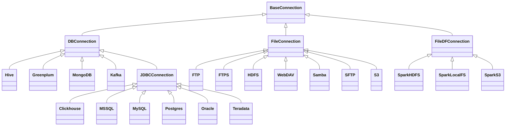

# Concepts { #DBR-onetl-concepts }

Here you can find detailed documentation about each one of the onETL concepts and how to use them.

## Connection { #DBR-onetl-concepts-connection }

### Connection basics { #DBR-onetl-concepts-connection-basics }

onETL is used to pull and push data into other systems, and so it has a first-class `Connection` concept for storing credentials that are used to communicate with external systems.

A `Connection` is essentially a set of parameters, such as username, password, hostname.

To create a connection to a specific storage type, you must use a class that matches the storage type. The class name is the same as the storage type name (`Oracle`, `MSSQL`, `SFTP`, etc):

```python
from onetl.connection import SFTP

sftp = SFTP(
    host="sftp.test.com",
    user="onetl",
    password="onetl",
)
```

All connection types are inherited from the parent class `BaseConnection`.

### Connection class diagram { #DBR-onetl-concepts-connection-class-diagram }



### DBConnection { #DBR-onetl-concepts-dbconnection }

Classes inherited from `DBConnection` could be used for accessing databases.

A `DBConnection` could be instantiated as follows:

```python
from onetl.connection import MSSQL

mssql = MSSQL(
    host="mssqldb.demo.com",
    user="onetl",
    password="onetl",
    database="Telecom",
    spark=spark,
)
```

where **spark** is the current SparkSession.
`onETL` uses `Spark` and specific Java connectors under the hood to work with databases.

For a description of other parameters, see the documentation for the [available DBConnections][DBR-onetl-connection-db-connection-db-connections].

### FileConnection { #DBR-onetl-concepts-fileconnection }

Classes inherited from `FileConnection` could be used to access files stored on the different file systems/file servers

A `FileConnection` could be instantiated as follows:

```python
from onetl.connection import SFTP

sftp = SFTP(
    host="sftp.test.com",
    user="onetl",
    password="onetl",
)
```

For a description of other parameters, see the documentation for the [available FileConnections][DBR-onetl-connection-file-connection-file-connections].

### FileDFConnection { #DBR-onetl-concepts-filedfconnection }

Classes inherited from `FileDFConnection` could be used for accessing files as Spark DataFrames.

A `FileDFConnection` could be instantiated as follows:

```python
from onetl.connection import SparkHDFS

spark_hdfs = SparkHDFS(
    host="namenode1.domain.com",
    cluster="mycluster",
    spark=spark,
)
```

where **spark** is the current SparkSession.
`onETL` uses `Spark` and specific Java connectors under the hood to work with DataFrames.

For a description of other parameters, see the documentation for the [available FileDFConnections][DBR-onetl-connection-file-df-connection-file-dataframe-connections].

### Checking connection availability { #DBR-onetl-concepts-checking-connection-availability }

Once you have created a connection, you can check the database/filesystem availability using the method `check()`:

```python
mssql.check()
sftp.check()
spark_hdfs.check()
```

It will raise an exception if database/filesystem cannot be accessed.

This method returns connection itself, so you can create connection and immediately check its availability:

```python
mssql = MSSQL(
    host="mssqldb.demo.com",
    user="onetl",
    password="onetl",
    database="Telecom",
    spark=spark,
).check()  # <--
```

## Extract/Load data { #DBR-onetl-concepts-extractload-data }

### Basics { #DBR-onetl-concepts-basics }

As we said above, onETL is used to extract data from and load data into remote systems.

onETL provides several classes for this:

* [DBReader][DBR-onetl-db-reader]
* [DBWriter][DBR-onetl-db-writer]
* [FileDFReader][DBR-onetl-file-df-reader-filedf-reader-0]
* [FileDFWriter][DBR-onetl-file-df-writer-filedf-writer-0]
* [FileDownloader][DBR-onetl-file-downloader-0]
* [FileUploader][DBR-onetl-file-uploader-0]
* [FileMover][DBR-onetl-file-mover-0]

All of these classes have a method `run()` that starts extracting/loading the data:

```python
from onetl.db import DBReader, DBWriter

reader = DBReader(
    connection=mssql,
    source="dbo.demo_table",
    columns=["column_1", "column_2"],
)

# Read data as Spark DataFrame
df = reader.run()

db_writer = DBWriter(
    connection=hive,
    target="dl_sb.demo_table",
)

# Save Spark DataFrame to Hive table
writer.run(df)
```

### Extract data { #DBR-onetl-concepts-extract-data }

To extract data you can use classes:

| | Use case | Connection | `run()` gets | `run()` returns |
| -- | - | - | - | --- |
| [`DBReader`][DBR-onetl-db-reader] | Reading data from a database | Any [`DBConnection`][DBR-onetl-connection-db-connection-db-connections] | - | [Spark DataFrame](https://spark.apache.org/docs/latest/api/python/reference/pyspark.sql/dataframe.html#dataframe) |
| [`FileDFReader`][DBR-onetl-file-df-reader-filedf-reader-0] | Read data from a file or set of files | Any [`FileDFConnection`][DBR-onetl-connection-file-df-connection-file-dataframe-connections] | No input, or List[File path on FileSystem] | [Spark DataFrame](https://spark.apache.org/docs/latest/api/python/reference/pyspark.sql/dataframe.html#dataframe) |
| [`FileDownloader`][DBR-onetl-file-downloader-0] | Download files from remote FS to local FS | Any [`FileConnection`][DBR-onetl-connection-file-connection-file-connections] | No input, or List[File path on remote FileSystem] | [`DownloadResult`][DBR-onetl-file-downloader-result] |

### Load data { #DBR-onetl-concepts-load-data }

To load data you can use classes:

| | Use case | Connection | `run()` gets | `run()` returns |
| - | -- | - | --- | -- |
| [`DBWriter`][DBR-onetl-db-writer] | Writing data from a DataFrame to a database | Any [`DBConnection`][DBR-onetl-connection-db-connection-db-connections] | [Spark DataFrame](https://spark.apache.org/docs/latest/api/python/reference/pyspark.sql/dataframe.html#dataframe) | None |
| [`FileDFWriter`][DBR-onetl-file-df-writer-filedf-writer-0] | Writing data from a DataFrame to a folder | Any [`FileDFConnection`][DBR-onetl-connection-file-df-connection-file-dataframe-connections] | [Spark DataFrame](https://spark.apache.org/docs/latest/api/python/reference/pyspark.sql/dataframe.html#dataframe) | None |
| [`FileUploader`][DBR-onetl-file-uploader-0] | Uploading files from a local FS to remote FS | Any [`FileConnection`][DBR-onetl-connection-file-connection-file-connections] | List[File path on local FileSystem] | [`UploadResult`][DBR-onetl-file-uploader-result] |

### Manipulate data { #DBR-onetl-concepts-manipulate-data }

To manipulate data you can use classes:

| | Use case | Connection | `run()` gets | `run()` returns |
| - | - | -- | -- | - |
| [`FileMover`][DBR-onetl-file-mover-0] | Move files between directories in remote FS | Any [`FileConnection`][DBR-onetl-connection-file-connection-file-connections] | List[File path on remote FileSystem] | [`MoveResult`][DBR-onetl-file-mover-result] |

### Options { #DBR-onetl-concepts-options }

Extract and load classes have a `options` parameter, which has a special meaning:

* all other parameters - *WHAT* we extract / *WHERE* we load to
* `options` parameter - *HOW* we extract/load data

```python
db_reader = DBReader(
    # WHAT do we read:
    connection=mssql,
    source="dbo.demo_table",  # some table from MSSQL
    columns=["column_1", "column_2"],  # but only specific set of columns
    where="column_2 > 1000",  # only rows matching the clause
    # HOW do we read:
    options=MSSQL.ReadOptions(
        numPartitions=10,  # read in 10 parallel jobs
        partitionColumn="id",  # balance data read by assigning each job a part of data using `hash(id) mod N` expression
        partitioningMode="hash",
        fetchsize=1000,  # each job will fetch block of 1000 rows each on every read attempt
    ),
)

db_writer = DBWriter(
    # WHERE do we write to - to some table in Hive
    connection=hive,
    target="dl_sb.demo_table",
    # HOW do we write - overwrite all the data in the existing table
    options=Hive.WriteOptions(if_exists="replace_entire_table"),
)

file_downloader = FileDownloader(
    # WHAT do we download - files from some dir in SFTP
    connection=sftp,
    source_path="/source",
    filters=[Glob("*.csv")],  # only CSV files
    limits=[MaxFilesCount(1000)],  # 1000 files max
    # WHERE do we download to - a specific dir on local FS
    local_path="/some",
    # HOW do we download:
    options=FileDownloader.Options(
        delete_source=True,  # after downloading each file remove it from source_path
        if_exists="replace_file",  # replace existing files in the local_path
    ),
)

file_uploader = FileUploader(
    # WHAT do we upload - files from some local dir
    local_path="/source",
    # WHERE do we upload to- specific remote dir in HDFS
    connection=hdfs,
    target_path="/some",
    # HOW do we upload:
    options=FileUploader.Options(
        delete_local=True,  # after uploading each file remove it from local_path
        if_exists="replace_file",  # replace existing files in the target_path
    ),
)

file_mover = FileMover(
    # WHAT do we move - files in some remote dir in HDFS
    source_path="/source",
    connection=hdfs,
    # WHERE do we move files to
    target_path="/some",  # a specific remote dir within the same HDFS connection
    # HOW do we load - replace existing files in the target_path
    options=FileMover.Options(if_exists="replace_file"),
)

file_df_reader = FileDFReader(
    # WHAT do we read - *.csv files from some dir in S3
    connection=s3,
    source_path="/source",
    file_format=CSV(),
    # HOW do we read - load files from /source/*.csv, not from /source/nested/*.csv
    options=FileDFReader.Options(recursive=False),
)

file_df_writer = FileDFWriter(
    # WHERE do we write to - as .csv files in some dir in S3
    connection=s3,
    target_path="/target",
    file_format=CSV(),
    # HOW do we write - replace all existing files in /target, if exists
    options=FileDFWriter.Options(if_exists="replace_entire_directory"),
)
```

More information about `options` could be found on [`DBConnection`][DBR-onetl-connection-db-connection-db-connections] and [`FileDownloader`][DBR-onetl-file-downloader-0] / [`FileUploader`][DBR-onetl-file-uploader-0] / [`FileMover`][DBR-onetl-file-mover-0] / [`FileDFReader`][DBR-onetl-file-df-reader-filedf-reader-0] / [`FileDFWriter`][DBR-onetl-file-df-writer-filedf-writer-0] documentation.

### Read Strategies { #DBR-onetl-concepts-read-strategies }

onETL have several builtin strategies for reading data:

1. [Snapshot strategy][DBR-onetl-strategy-snapshot-strategy] (default strategy)
2. [Incremental strategy][DBR-onetl-connection-db-connection-clickhouse-read-incremental-strategy]
3. [Snapshot batch strategy][DBR-onetl-strategy-snapshot-batch-strategy]
4. [Incremental batch strategy][DBR-onetl-strategy-incremental-batch-strategy]

For example, an incremental strategy allows you to get only new data from the table:

```python
from onetl.strategy import IncrementalStrategy

reader = DBReader(
    connection=mssql,
    source="dbo.demo_table",
    hwm_column="id",  # detect new data based on value of "id" column
)

# first run
with IncrementalStrategy():
    df = reader.run()

sleep(3600)

# second run
with IncrementalStrategy():
    # only rows, that appeared in the source since previous run
    df = reader.run()
```

or get only files which were not downloaded before:

```python
from onetl.strategy import IncrementalStrategy

file_downloader = FileDownloader(
    connection=sftp,
    source_path="/remote",
    local_path="/local",
    hwm_type="file_list",  # save all downloaded files to a list, and exclude files already present in this list
)

# first run
with IncrementalStrategy():
    files = file_downloader.run()

sleep(3600)

# second run
with IncrementalStrategy():
    # only files, that appeared in the source since previous run
    files = file_downloader.run()
```

Most of strategies are based on [`HWM`][DBR-onetl-hwm-store-hwm], Please check each strategy documentation for more details

### Why just not use Connection class for extract/load? { #DBR-onetl-concepts-why-just-not-use-connection-class-for-extractload }

Connections are very simple, they have only a set of some basic operations,
like `mkdir`, `remove_file`, `get_table_schema`, and so on.

High-level operations, like

* [`strategy`][DBR-onetl-strategy-read-strategies] support
* Handling metadata push/pull
* Handling different options, like `if_exists="replace_file"` in case of file download/upload

is moved to a separate class which calls the connection object methods to perform some complex logic.
