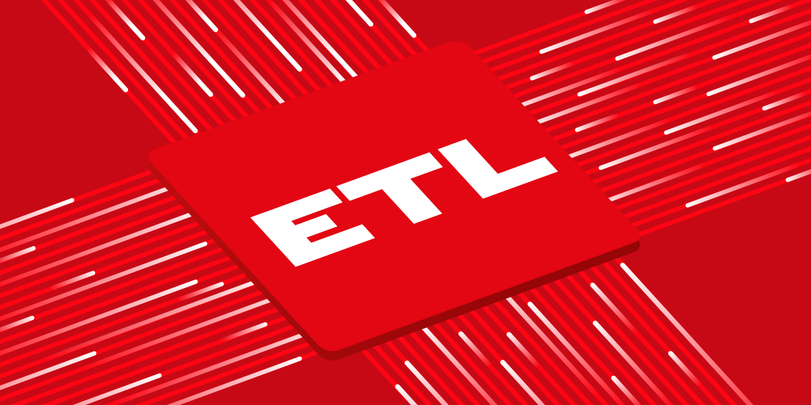

        

# What is onETL? { #DBR-onetl--what-is-onetl }

Python ETL/ELT library powered by [Apache Spark](https://spark.apache.org/) & other open-source tools.

# Goals { #DBR-onetl--goals }

- Provide unified classes to extract data from (**E**) & load data to (**L**) various stores.
- Provides [Spark DataFrame API](https://spark.apache.org/docs/latest/api/python/reference/pyspark.sql/api/pyspark.sql.DataFrame.html) for performing transformations (**T**) in terms of *ETL*.
- Provide direct assess to database, allowing to execute SQL queries, as well as DDL, DML, and call functions/procedures. This can be used for building up *ELT* pipelines.
- Support different [read strategies][DBR-onetl-strategy-read-strategies] for incremental and batch data fetching.
- Provide [hooks][DBR-onetl-hooks] & [plugins][DBR-onetl-plugins] mechanism for altering behavior of internal classes.

# Non-goals { #DBR-onetl--non-goals }

- onETL is not a Spark replacement. It just provides additional functionality that Spark does not have, and improves UX for end users.
- onETL is not a framework, as it does not have requirements to project structure, naming, the way of running ETL/ELT processes, configuration, etc. All of that should be implemented in some other tool.
- onETL is deliberately developed without any integration with scheduling software like Apache Airflow. All integrations should be implemented as separated tools.
- Only batch operations, no streaming. For streaming prefer [Apache Flink](https://flink.apache.org/).

# Requirements { #DBR-onetl--requirements }

- **Python** 3.10 - 3.14
- PySpark 3.2.x -- 4.2.x (depends on used connector)
- Java 8+ (required by Spark, see below)
- Kerberos libs & GCC (required by `Hive`, `HDFS` and `SparkHDFS` connectors)

# Supported storages { #DBR-onetl--supported-storages }

| Type               | Storage      | Powered by                                                                                                              |
|--------------------|--------------|-------------------------------------------------------------------------------------------------------------------------|
| Database {: rowspan=5} | Clickhouse MSSQL MySQL Postgres Oracle Teradata   |   Apache Spark [JDBC Data Source](https://spark.apache.org/docs/latest/sql-data-sources-jdbc.html)                      |
| Hive         | Apache Spark [Hive integration](https://spark.apache.org/docs/latest/sql-data-sources-hive-tables.html)                |
| Kafka        | Apache Spark [Kafka integration](https://spark.apache.org/docs/latest/structured-streaming-kafka-integration.html)     |
| Greenplum    | VMware [Greenplum Spark connector](https://docs.vmware.com/en/VMware-Greenplum-Connector-for-Apache-Spark/index.html) |
| MongoDB      | [MongoDB Spark connector](https://www.mongodb.com/docs/spark-connector/current)                                       |
| File {: rowspan=6}  | HDFS         | [HDFS Python client](https://pypi.org/project/hdfs/)                                                                  |
| S3           | [minio-py client](https://pypi.org/project/minio/)                                                                    |
| SFTP         | [Paramiko library](https://pypi.org/project/paramiko/)                                                                |
| FTP FTPS       | [FTPUtil library](https://pypi.org/project/ftputil/)                                                                  |
| WebDAV       | [WebdavClient3 library](https://pypi.org/project/webdavclient3/)                                                     |
| Samba        | [pysmb library](https://pypi.org/project/pysmb/)                                                                      |
| Files as DataFrame {: rowspan=2} | SparkLocalFS SparkHDFS | Apache Spark [File Data Source](https://spark.apache.org/docs/latest/sql-data-sources-generic-options.html)           |
| SparkS3      | [Hadoop AWS](https://hadoop.apache.org/docs/current3/hadoop-aws/tools/hadoop-aws/index.html) library                  |
